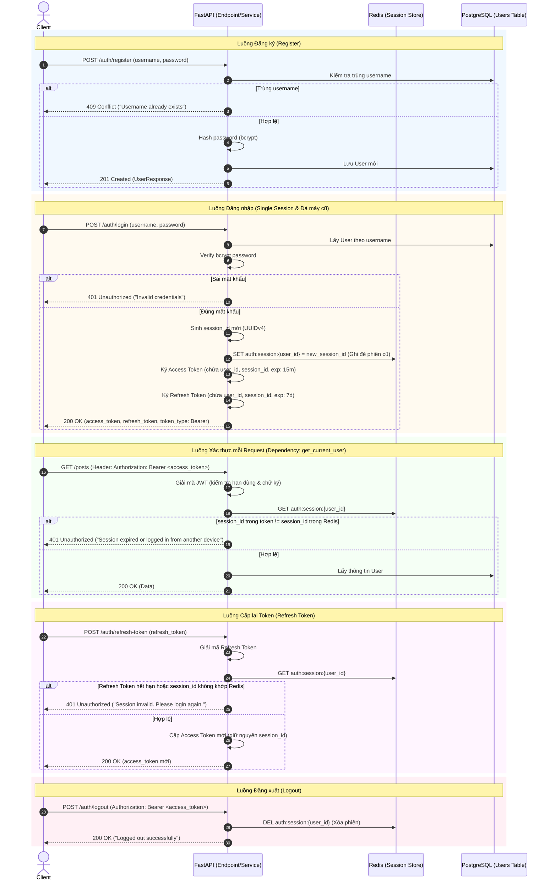

# Thiết Kế Chi Tiết: Tính Năng Authentication & Authorization

Tài liệu đặc tả kiến trúc và luồng xử lý tính năng Xác thực người dùng (Auth).  
*Chỉ thảo luận tài liệu, không triển khai code cho đến khi có lệnh.*

---

## 1. Danh Sách Endpoints (API Specification)

| Phương thức | Endpoint | Chức năng | Yêu cầu xác thực |
| :--- | :--- | :--- | :--- |
| `POST` | `/api/v1/auth/register` | Đăng ký tài khoản mới | Không |
| `POST` | `/api/v1/auth/login` | Đăng nhập (Revoke phiên cũ, cấp cặp Access & Refresh Token) | Không |
| `POST` | `/api/v1/auth/refresh-token` | Đổi Access Token mới bằng Refresh Token hợp lệ | Không (gửi Refresh Token) |
| `POST` | `/api/v1/auth/logout` | Đăng xuất (Xóa phiên hiện tại trên Redis) | Có (`access_token`) |
| `GET` | `/api/v1/auth/me` | Lấy thông tin tài khoản hiện tại | Có (`access_token`) |
| `POST` | `/api/v1/auth/change-password` | Đổi mật khẩu tài khoản | Có (`access_token`) |
| `POST` | `/api/v1/auth/forgot-password` | Yêu cầu mã OTP / Token khôi phục mật khẩu | Không |
| `POST` | `/api/v1/auth/reset-password` | Xác thực OTP / Token để đặt lại mật khẩu mới | Không |

---

## 2. Thiết Kế Cơ Chế Single Session Trên Redis

Mỗi tài khoản tại một thời điểm chỉ được phép hoạt động trên duy nhất **1 thiết bị**. Khi đăng nhập ở thiết bị mới, thiết bị cũ sẽ tự động bị đá ra (`Revoke`).

### 2.1 Cấu trúc Key trên Redis

1. **Active Session Key:**
   - **Key:** `auth:session:{user_id}`
   - **Value:** `current_session_id` (UUIDv4)
   - **TTL:** Bằng thời gian sống của Refresh Token (mặc định 7 ngày).

2. **Blacklist Access Token (tùy chọn khi Logout):**
   - **Key:** `auth:blacklist:{jti}`
   - **TTL:** Bằng thời gian sống còn lại của Access Token (15 phút).

---

## 3. Luồng Xử Lý Chi Tiết (Flows)

---

## 4. Cơ Chế Quên & Đặt Lại Mật Khẩu (Forgot Password)

1. **Yêu cầu khôi phục (`POST /auth/forgot-password`):**
   - Input: `username` hoặc `email`.
   - Sinh OTP ngắn hạn (6 số) hoặc `reset_token`.
   - Lưu vào Redis: `auth:reset_pwd:{token} = user_id` (TTL: 10 - 15 phút).
   - Gửi token/OTP qua kênh thông báo (Telegram / Email).
2. **Đặt lại mật khẩu (`POST /auth/reset-password`):**
   - Input: `reset_token`, `new_password`.
   - Kiểm tra `reset_token` trong Redis. Nếu đúng:
     - Hash mật khẩu mới và cập nhật vào PostgreSQL.
     - Xóa `reset_token` trong Redis.
     - Xóa luôn `auth:session:{user_id}` trong Redis để đá tất cả các phiên đăng nhập cũ ra ngoài (bắt buộc đăng nhập lại bằng pass mới).

---

## 5. Những Thay Đổi Về Cấu Trúc Mã Nguồn Dự Kiến (Khi Triển Khai)

1. **Model & Schema:**
   - Cập nhật [app/models/user.py](file:///home/trvv/Workspace/base/fastapi-base-project/app/models/user.py) (thêm `is_active`, `role` nếu cần).
   - Tạo [app/schemas/auth.py](file:///home/trvv/Workspace/base/fastapi-base-project/app/schemas/auth.py) (LoginInput, TokenResponse, RegisterInput, RefreshInput, ChangePasswordInput).
2. **Dependency & Core:**
   - Tạo [app/dependencies/auth.py](file:///home/trvv/Workspace/base/fastapi-base-project/app/dependencies/auth.py) với hàm `get_current_user` kiểm tra cả chữ ký JWT lẫn `session_id` trong Redis.
3. **Endpoint & Service:**
   - [app/api/v1/auth.py](file:///home/trvv/Workspace/base/fastapi-base-project/app/api/v1/auth.py): Khai báo router xác thực.
   - [app/services/auth.py](file:///home/trvv/Workspace/base/fastapi-base-project/app/services/auth.py): Module async functions xử lý logic nghiệp vụ.
4. **Testing Suite:**
   - [tests/api/test_auth.py](file:///home/trvv/Workspace/base/fastapi-base-project/tests/api/test_auth.py): Viết test cases kiểm thử tự động toàn bộ luồng Auth và Single Session.